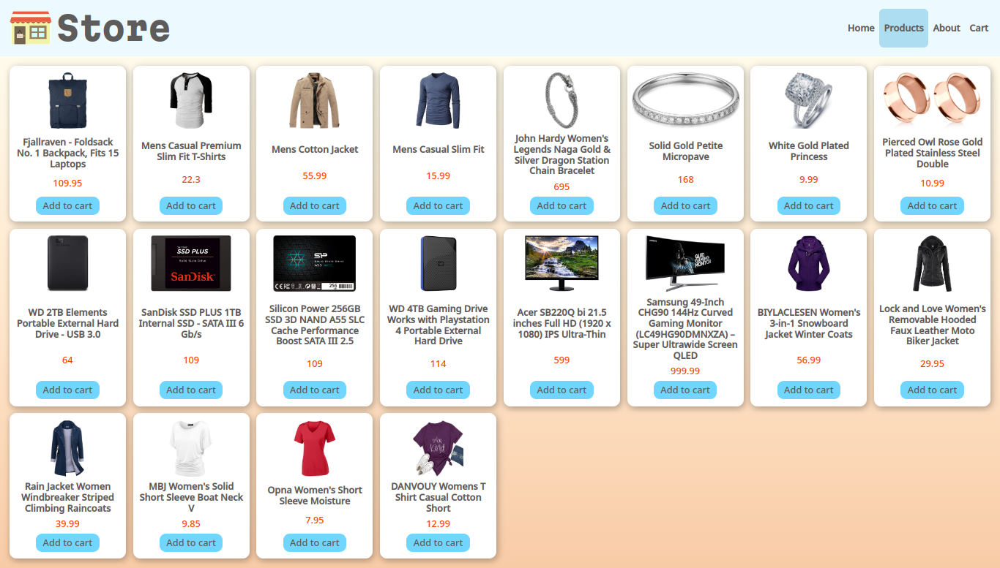

# E-Commerce App

[Live preview](https://main--subtle-souffle-c43255.netlify.app/)

## Introduction

This repository contains the source code for an E-Commerce web application built using React, React Router, and CSS Modules. The app provides a user-friendly interface for browsing products, adding them to a cart, and completing purchases.

## Features

- **Product Listings:** Browse a variety of products displayed in a user-friendly interface.
- **Shopping Cart:** Add products to a shopping cart, view the cart contents, and proceed to checkout.
- **Checkout Process:** Navigate through the checkout process.
- **Responsive Design:** The app is designed to work seamlessly on desktop and mobile devices.

## Technologies Used

- **React:** JavaScript library for building user interfaces.
- **React Router:** Declarative routing for React.js applications.
- **CSS Modules:** Local scope CSS by default in React components.

## Folder Structure

- **src/:** Contains the source code for the application.
- **styles/:** CSS Modules for styling components.
- **Root.js:** Main component that sets up routing and app structure.
- **main.js:** Entry point for the app, renders the main component.
